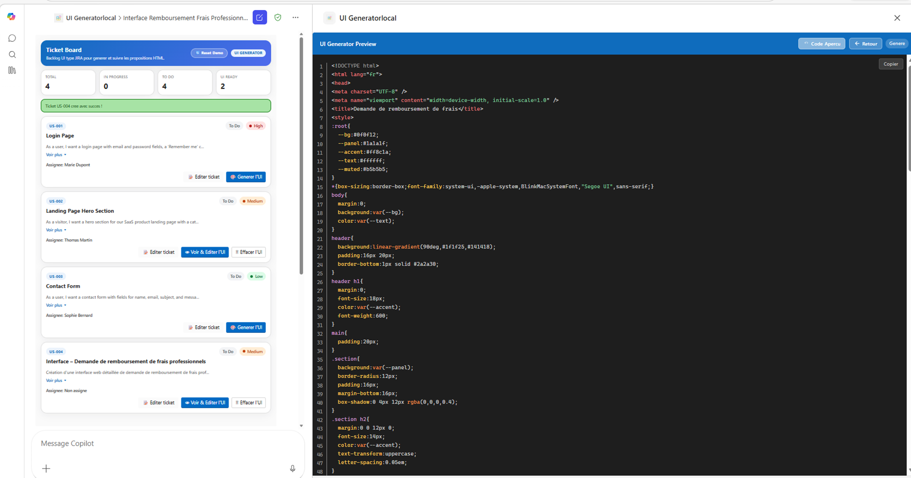

# UI Generator and Backlog Management for M365 Copilot

> Microsoft 365 Copilot declarative agent capable of **generating HTML/CSS/JS interfaces on the fly**, **managing a UI ticket backlog**, and then **combining both** to create, visualize, iterate on, and save interface proposals directly in the conversation flow.

### 🎨 Generating a Hero landing page from a ticket


### 📋 Complex application form generated in one sentence

> *“I would like to create a fairly detailed professional expense reimbursement request interface, with a black theme, an orange title, white text, and a banner at the top to display the form name.”*


### 💻 Code view — inspect and copy the generated HTML/CSS/JS



### 🗂️ Full-screen Ticket Board — manage your entire backlog


> 🚀 **First time?** Check the [Getting Started Guide](docs/getting-started.md) — from installing VS Code to your first F5.

---

## Table of contents

- [Overview](#overview)
- [Supported use cases](#supported-use-cases)
- [Key features](#key-features)
- [Architecture](#architecture)
- [Technical stack](#technical-stack)
- [Available MCP tools](#available-mcp-tools)
- [HTML Widgets](#html-widgets)
- [Project structure](#project-structure)
- [Prerequisites](#prerequisites)
- [Installation](#installation)
- [🚀 Getting Started](#-getting-started)
- [Usage flow](#usage-flow)
- [Data and persistence](#data-and-persistence)
- [Skill references](#skill-references)
- [Version](#version)
- [Reference template](#reference-template)
- [Documentation references](#documentation-references)

---

## Overview

This project is an **M365 Copilot declarative agent** connected to a **Node.js/TypeScript MCP Server**. It turns a natural-language request into a usable HTML/CSS/JS interface while also providing simple management of a UI ticket backlog.

The goal is to cover a complete cycle:

1. describe an interface,
2. generate a prototype,
3. preview it in a widget,
4. iterate on it through chat,
5. attach it to a ticket or save it for later.

---

## Supported use cases

### Use case 1 — Generate a UI from an existing ticket

The user selects a ticket from the backlog, asks the agent to produce an interface proposal, then views the result in the side panel. They can then refine the interface through conversation and keep the proposal associated with the ticket.

### Use case 2 — Create a ticket, then generate its UI

The user describes a need, the agent creates a ticket with the useful metadata (status, priority, assignee), then generates the corresponding interface from this new backlog entry.

### Use case 3 — Generate a freeform UI without a ticket

The user directly describes an interface without going through the backlog. The agent then generates a standalone UI, enables successive iterations, and may later suggest saving the result to an existing or newly created ticket.

---

## Key features

This project is a **Microsoft 365 Copilot declarative agent** (Declarative Copilot Agent), connected to an **MCP Server** via the **Model Context Protocol**, with interactive **MCP Apps widgets** (Embedded Apps) displayed directly in M365 Copilot chat.

- **M365 Copilot declarative agent** — manifest v1.26, agent v1.6, plugin v2.4 with `RemoteMCPServer`
- **Node.js/TypeScript/Express MCP Server** — 10 tools exposed via Streamable HTTP
- **MCP Apps widgets** — 2 interactive HTML widgets embedded in chat (backlog + preview)
- **HTML/CSS/JS** interface generation from a natural-language description
- Incremental updates to an existing UI through chat
- UI ticket backlog management with **status**, **priority**, and **assignee**
- Immediate preview in **full-screen mode** with automatic real-time refresh
- Saving an interface proposal to an existing or new ticket
- Quick reset of demo data
- Simple storage in JSON files, **without a database**

---

## Architecture

```text
┌───────────────────────────────────────────────────────┐
│                  M365 Copilot Chat                    │
│        (Declarative Agent + MCP App widgets)          │
└──────────────────────────┬────────────────────────────┘
                           │ MCP Protocol (HTTP/SSE)
┌──────────────────────────▼────────────────────────────┐
│                 MCP Server (Node.js)                  │
│                                                       │
│  Tools: generateUI, updateUI, listTickets, getTicket  │
│         generateUIFromTicket, saveUIToTicket          │
│         createTicket, updateTicket, resetTickets      │
│         viewTicketUI                                  │
│                                                       │
│  HTML Widgets (MCP Apps)                              │
│    · tickets-list-widget (backlog + preview)          │
│    · ui-preview-widget (standalone preview)           │
└───────────────────────────────────────────────────────┘
         │
    ┌────▼────┐
    │  JSON   │  tickets.json (runtime data)
    │  Files  │  tickets-default.json (demo reset)
    └─────────┘
```

---

## Technical stack

| Component | Technology |
|-----------|-------------|
| Agent | M365 Declarative Copilot |
| Manifest | `manifest.json` v1.26 |
| Declarative agent schema | v1.6 |
| MCP Server | Node.js + TypeScript + Express |
| Transport | Streamable HTTP |
| Interactive widgets | `@modelcontextprotocol/ext-apps` |
| UI / theme | Fluent UI Web Components |
| Local development | M365 Agents Toolkit, devtunnel, F5 |
| Persistence | JSON files (`tickets.json`) |

---

## Available MCP tools

The server exposes **10 MCP tools**.

| Tool | Description |
|------|-------------|
| `generateUI` | Generates HTML/CSS/JS from a freeform description, without a ticket |
| `updateUI` | Updates an already generated freeform UI |
| `listTickets` | Lists all tickets in the backlog widget |
| `getTicket` | Retrieves the details of a ticket, including its UI proposal |
| `generateUIFromTicket` | Generates a UI from a ticket description and saves it to that ticket |
| `saveUIToTicket` | Saves a UI to an existing ticket |
| `createTicket` | Creates a new ticket, with an optional `htmlCode` |
| `updateTicket` | Updates a ticket's fields |
| `resetTickets` | Resets the backlog with demo data |
| `viewTicketUI` | Opens a ticket's UI proposal in the preview panel |

---

## HTML Widgets

The project includes **2 HTML widgets** used as MCP Apps in Copilot chat.

### 1. `tickets-list-widget.html`

Backlog widget displaying:

- tickets with status badges,
- priorities with color coding,
- the **Generate UI**, **View & Edit UI**, and **Delete UI** actions,
- a full-screen preview mode,
- automatic refresh by polling.

### 2. `ui-preview-widget.html`

Standalone preview widget intended for freeform generations (use case 3), with:

- direct HTML rendering,
- code display,
- syntax highlighting via **Prism.js**.

---

## Project structure

```text
Copilot-Generate-UI-From-UserStory-and-manage-Tickets/
├── appPackage/
│   ├── manifest.json                 ← M365 app manifest (v1.26)
│   ├── uiGeneratorAgent.json         ← Agent definition (v1.6)
│   ├── ai-plugin.json                ← MCP tools + LLM routing (v2.4)
│   └── instruction.txt               ← LLM system prompt
├── mcp-server/
│   ├── src/
│   │   ├── index.ts                  ← Express server + CORS
│   │   └── mcp-server.ts             ← 10 MCP tools + 2 widget resources
│   ├── assets/
│   │   ├── tickets-list-widget.html  ← Backlog + full-screen preview
│   │   └── ui-preview-widget.html    ← Standalone preview
│   ├── data/
│   │   ├── tickets.json              ← Runtime data
│   │   └── tickets-default.json      ← Demo data
│   ├── package.json
│   └── .env.sample
├── docs/
│   ├── getting-started.md
│   ├── TEMPLATE.md
│   └── skills/                       ← Reference documentation
├── m365agents.yml                    ← Provisioning + deployment
├── m365agents.local.yml              ← Local debug with devtunnel
└── env/
    └── .env.dev                      ← Environment variables
```

---

## Prerequisites

Before starting the project, make sure you have:

- **Node.js 18, 20, or 22**
- **Visual Studio Code** with the **Microsoft 365 Agents Toolkit** extension
- **A Microsoft 365 account** with a Copilot license
- No additional third-party secrets: **no API key** and **no database** required

---

## Installation

```bash
git clone https://github.com/romain-gerard-exp/Copilot-Generate-UI-From-UserStory-and-manage-Tickets.git
cd Copilot-Generate-UI-From-UserStory-and-manage-Tickets
cd mcp-server
cp .env.sample .env
npm install
cd ..
# F5 dans VS Code → Debug in Copilot (Edge)
```

### Installation notes

- The project can be run locally without a database.
- Tickets are stored in JSON files to simplify demos and iterations.
- The standard debug flow relies on **M365 Agents Toolkit** and **devtunnel**.

---

## 🚀 Getting Started

For a step-by-step setup, see the dedicated guide: [docs/getting-started.md](docs/getting-started.md)

Quick start:

1. Open the project in VS Code
2. Check the local configuration in `env/` and `mcp-server/.env`
3. Start debugging with **F5**
4. Wait for Copilot to open in Edge
5. Interact with the agent, for example:
   - *Create a modern registration form with first name, last name, email, and a primary button*
   - *Show the backlog and generate the UI for the highest-priority ticket*
   - *Save this proposal to a new UI ticket*

---

## Usage flow

### Generate a UI from an existing ticket

1. List the backlog tickets
2. Select a ticket
3. Generate an interface proposal
4. View the rendering in the side panel
5. Request modifications in natural language
6. Save the final version to the ticket

### Create a ticket, then generate its UI

1. Describe the business or functional need
2. Create the ticket with its metadata
3. Generate the corresponding interface
4. Review the result in the widget
5. Update the ticket if needed

### Generate a freeform UI without a ticket

1. Freely describe an interface in chat
2. Display the preview in the standalone widget
3. Iterate as many times as needed
4. Then choose whether to keep the result as-is or attach it to a ticket

---

## Data and persistence

Persistence relies only on JSON files:

- `mcp-server/data/tickets.json` : current backlog state
- `mcp-server/data/tickets-default.json` : reference state for reset

This choice enables:

- quick onboarding,
- a simple demo environment,
- no dependency on a database,
- instant resets via the `resetTickets` tool.

---

## Skill references

| Skill | Description |
|-------|-------------|
| [ui-generation-workflow.md](docs/skills/ui-generation-workflow.md) | **How to generate, edit, and save an interface from Copilot chat** |
| [declarative-agent-mcp-setup.md](docs/skills/declarative-agent-mcp-setup.md) | How to create an M365 declarative agent connected to an MCP Server |
| [mcp-app-widgets.md](docs/skills/mcp-app-widgets.md) | How to build interactive widgets in M365 Copilot chat |
| [mcp-app-csp-resources.md](docs/skills/mcp-app-csp-resources.md) | How to unblock CDN resources in M365 iframes |
| [widget-display-and-resourceuri.md](docs/skills/widget-display-and-resourceuri.md) | How to control which widget opens and avoid loops |
| [widget-fullscreen-and-state.md](docs/skills/widget-fullscreen-and-state.md) | How to manage full screen without losing widget state |
| [widget-realtime-updates.md](docs/skills/widget-realtime-updates.md) | How to update a widget in real time while the AI is working |
| [llm-tool-routing.md](docs/skills/llm-tool-routing.md) | How to guide the LLM so it chooses the right tool |

---

## Version

| Version | Description |
|---------|-------------|
| `v1.0.0` | Initial version — complete agent with 3 UI use cases, backlog widget, full-screen preview, and real-time polling |

---

## Reference template

> Base template: see [docs/TEMPLATE.md](docs/TEMPLATE.md)

---

## Documentation references

- Declarative Agents for Microsoft 365 : https://aka.ms/teams-toolkit-declarative-agent
- Model Context Protocol : https://modelcontextprotocol.io/
- MCP Apps (`@modelcontextprotocol/ext-apps`) : https://www.npmjs.com/package/@modelcontextprotocol/ext-apps
