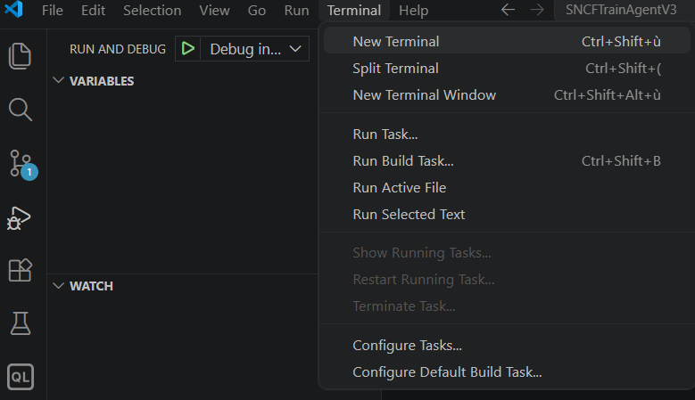
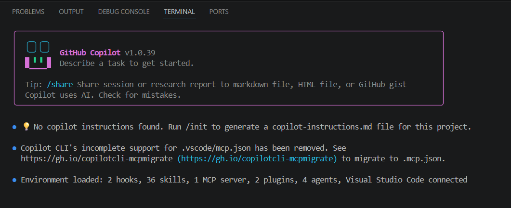
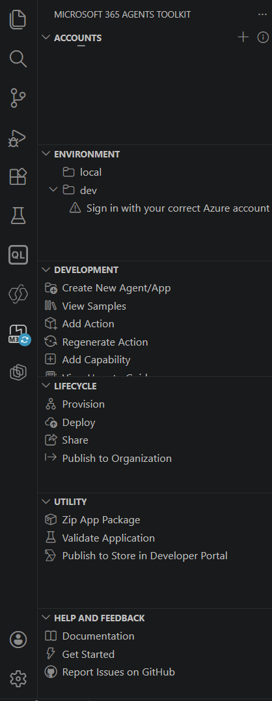
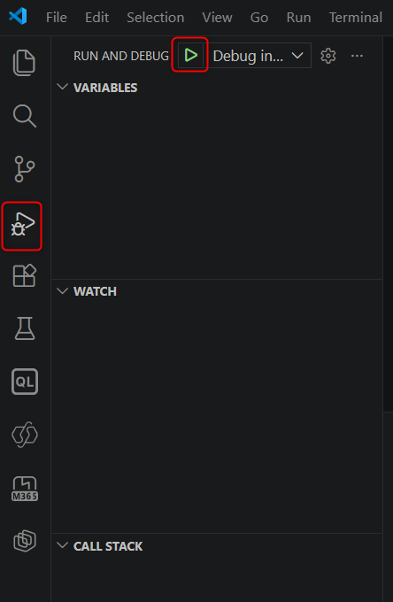
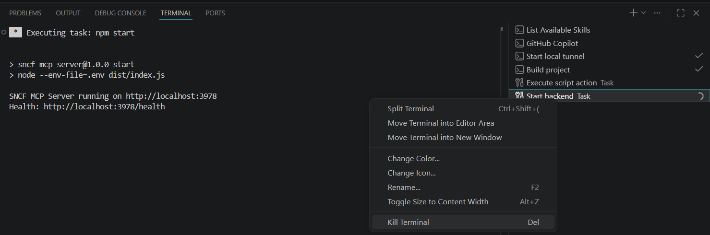

# Getting Started Guide - Copilot-Generate-UI-From-UserStory-and-manage-Tickets

> **Who is this for?** This guide is intended for someone who has never used VS Code, Node.js, or Microsoft 365 developer tools. It documents exactly what you need to install, and in what order, to reproduce this project. Each step corresponds to something the first developer on this project had to figure out on their own.

---

## Step 0 - Account prerequisites

Before installing anything, make sure you have:
- ✅ A **Microsoft 365 account** (E3, E5, Business Premium...)
- ✅ A **Copilot 365** license (required for the agent to be accessible in the Teams Copilot interface)
- ✅ A **GitHub account** (free)
- ✅ **Administrator access** on your machine (to install software)

### ⚠️ Note about the GitHub Copilot plan and AI models for vibe coding

GitHub Copilot comes in several plans. The **free plan** gives access to less capable models, which are less suited to a complex project like this one.

**To work seriously, a paid plan is strongly recommended:**

| Plan | Available models |
|------|------------------|
| Free | GPT-4o, Claude 3.5 Sonnet (very limited quota) |
| **Pro** | Claude Sonnet 4.6, GPT-4.1, GPT-5... extended quota |
| **Business** | Same as Pro + enterprise controls |

> This project was developed with a **paid plan** (Pro or Business) and the **Claude Sonnet 4.6** model. The quality of the generated code, understanding of the context, and ability to follow complex instructions depend directly on the model used.

### Monitor your credit usage

Paid plans include a monthly **"premium requests"** quota. Requests to advanced models (Claude Sonnet, GPT-5...) consume this quota faster.

To see your usage in VS Code: click the Copilot icon in the bottom-right corner → **Usage**


*Here: 100% of the "Included premium requests" quota has been used - the system switches to the "Overage Budget" (billing beyond the plan). The quota resets on the 1st of the month.*

> 💡 **Tip:** enable a limited overage budget (for example: $10) so you do not get blocked at the end of the month unexpectedly. Configurable in GitHub settings → Billing.

---

## Step 1 - Install Git

Git is required to clone and manage the source code.

1. Go to [git-scm.com/downloads](https://git-scm.com/downloads)
2. Download and install Git for Windows
3. During installation, keep the default options
4. Verify the installation: open a terminal and type:
   ```bash
   git --version
   # Should display: git version 2.x.x
   ```

---

## Step 2 - Install Node.js

Node.js is the runtime that runs the MCP Server.

1. Go to [nodejs.org](https://nodejs.org)
2. Download the **LTS** (Long Term Support) version - currently Node.js 20 or 22
3. Install with the default options
4. Verify:
   ```bash
   node --version   # v20.x.x or v22.x.x
   npm --version    # 10.x.x
   ```

> ⚠️ Do not use Node.js 16 or lower - native `fetch` is only available starting with Node.js 18.

---

## Step 3 - Install VS Code

VS Code is the code editor.

1. Go to [code.visualstudio.com](https://code.visualstudio.com)
2. Download and install it
3. Open VS Code

---

## Step 4 - Install VS Code extensions

Extensions can be installed from the Extensions panel (square icon in the left sidebar, or `Ctrl+Shift+X`).

### Required extension 1: M365 Agents Toolkit

This is the extension that handles the devtunnel, provisioning the agent in M365, and launching with F5.

1. In VS Code, open Extensions (`Ctrl+Shift+X`)
2. Search for: **"Teams Toolkit"** or **"M365 Agents Toolkit"**
3. Install the Microsoft extension (publisher: Microsoft)
4. A new panel appears in the left sidebar (Teams icon)

> 💡 The name changed: formerly "Teams Toolkit", now "M365 Agents Toolkit". Both work the same way.

### Required extension 2: GitHub Copilot

GitHub Copilot is the AI assistant built into VS Code.

1. Search for: **"GitHub Copilot"**
2. Install the GitHub extension
3. Sign in with your GitHub account when prompted

### Useful extension: GitHub Copilot in the terminal

**This is what lets you have an AI conversation directly in the VS Code terminal - the same way this project was developed.**

1. Open the integrated VS Code terminal: `` Ctrl+` `` (or `Ctrl+ù` depending on the keyboard)
2. Install the GitHub CLI:
   ```bash
   winget install GitHub.cli
   ```
   Or from [cli.github.com](https://cli.github.com)
3. Sign in:
   ```bash
   gh auth login
   ```
   Follow the instructions (a browser opens for authentication)
4. Start a Copilot conversation in the terminal:
   - Via the VS Code Command Palette: `Ctrl+Shift+P` → **"GitHub Copilot: Open Agent"** (or "Open Copilot in Terminal")
   - Or directly from the VS Code Copilot panel (chat icon in the left sidebar)

> 💡 This entire project was developed by dictating requests in French in this terminal, without writing code manually.

---

## Step 4b - Launch Copilot in the terminal (details)

Once GitHub CLI is installed and connected, here is how to start a Copilot session in the VS Code terminal.

### 1. Open a new terminal

In VS Code: **Terminal** menu → **New Terminal** (or `Ctrl+Shift+ù`)



### 2. Type the `Copilot` command

In the terminal that opens (PowerShell), type:

```
Copilot
```


### 3. Copilot starts

GitHub Copilot CLI launches with its interface in the terminal. The welcome message shows the version and the number of loaded skills/plugins.



The message `Environment loaded: X hooks, X skills, X MCP server, X plugins, X agents, Visual Studio Code connected` confirms that everything is loaded correctly.

### 4. Check the installed skills

To see the list of available skills, type `/skills` then press Enter:


The full list of skills is displayed with their status (enabled/disabled):


> 💡 Skills are Copilot's specialized capabilities. For this project, useful guides and references should be stored in `docs/skills/`.

### 5. Exit Copilot

Press **Escape** to leave the Copilot interface and return to the normal PowerShell terminal.

---

## Step 5 - Clone the project (optional)

> If you want to use this project as a starting point, clone it. If you prefer to start with a blank project, go directly to the next step and use the reference guides in `docs/skills/`.

```bash
git clone https://github.com/romain-gerard-exp/Copilot-Generate-UI-From-UserStory-and-manage-Tickets.git
cd Copilot-Generate-UI-From-UserStory-and-manage-Tickets
```

---

## Step 6 - Create the local configuration file

The `mcp-server/.env` file is not included in the repo (gitignored). You need to create it from the provided template:

```bash
cd mcp-server
copy .env.sample .env
```

Then open `mcp-server/.env` and leave only:

```env
PORT=3978
```

> ✅ **No other variable is required** for this project.
>
> ✅ **No API key** needs to be created.
>
> ✅ **No Dataverse configuration** is required.

---

## Step 7 - Install Node.js dependencies

```bash
npm install
```

---

## Step 8 - Sign in to M365 in VS Code

1. In VS Code, click the **M365 Agents Toolkit** icon in the left sidebar
2. Click **"Sign in to Microsoft 365"** in the **ACCOUNTS** section
3. Sign in with the account that has the Copilot 365 license
4. Check in the **ENVIRONMENT** section that the `dev` environment no longer shows the warning (the toolkit displays "Sign in with your correct Azure account" but this is indeed the professional Microsoft 365 account, the same one as Teams)



*The M365 Agents Toolkit panel shows the ACCOUNTS, ENVIRONMENT, DEVELOPMENT, and LIFECYCLE sections. If the warning "Sign in with your correct Azure account" appears under the environment, click it and sign in with the professional Microsoft 365 account (no Azure subscription is required, it is the same account used for Teams).*

---

## Step 9 - Run the agent in debug

### Open the Run and Debug panel

In VS Code, there are two ways to access debugging:
- **Keyboard shortcut:** `F5` directly (immediately launches the last selected profile)
- **Run and Debug panel:** click the icon in the left sidebar (triangle with a bug), then click the **green ▶** button at the top



*The green ▶ button at the top of the "RUN AND DEBUG" panel launches debugging. The dropdown next to it ("Debug in...") lets you choose the profile.*

### Select the correct profile

If multiple profiles appear in the dropdown, select **"Debug in Copilot (Edge)"**.

> 💡 The first time, if the list is empty or F5 does nothing, check that the **M365 Agents Toolkit** extension is installed - it is the one that adds the debug profile.

### What happens after F5

VS Code will automatically:
1. Create a **devtunnel** (public HTTPS tunnel to your localhost)
2. **Build** the TypeScript MCP server (`npm run build`)
3. **Upload** the app to your M365 tenant
4. Open **Edge** at [m365.cloud.microsoft](https://m365.cloud.microsoft)

In Edge, go to **Copilot** → the **"UI Generator"** agent should appear in the list.

> ⚠️ The first time, M365 may take a few minutes to recognize the agent. If the agent does not appear after 2-3 minutes, run F5 again.

> ⚠️ If Edge opens but you see a connection error to the MCP server, check that the "MCP Server" terminal in VS Code does not show a startup error.

### First test prompts

Once the agent is running, you can start with:
- `Show me the tickets`
- `Generate a contact form`
- `Create an interface for ticket US-001`

---

## Step 10 - Stop debugging cleanly (between tests)

When you stop a debug session and want to start a clean one again, you need to do a little cleanup - otherwise the local servers keep running in the background and the next F5 may run into port conflicts.

### 1. Close the Edge browser opened by debugging

Simply close the Edge window that opened on M365 Copilot.

### 2. Stop debugging in VS Code

Click the red square ■ in the debug bar at the top of VS Code (or `Shift+F5`).

### 3. Kill the server terminals that are still running

After debugging stops, several terminals often remain open and active (MCP server, devtunnel...). You must kill them manually.

**Method:** Right-click the relevant terminal → **Kill Terminal**



*In this screenshot: the "Start backend Task" terminal is running the MCP server (`npm start`, `node dist/index.js`). A right-click → "Kill Terminal" stops it cleanly.*

> 💡 The terminals created by the toolkit have recognizable names: "Start local tunnel", "Start backend", "Build project", etc. Identify them and kill them all before running F5 again.

> ⚠️ If you do not kill the terminals and run F5 again, you may get an `EADDRINUSE: address already in use` error - port 3978 (or another one) is already occupied by the old server instance.

---

## Summary of prerequisites

| Tool / item | Minimum version / value | Link / note |
|-------------|-------------------------|-------------|
| Git | 2.x | [git-scm.com](https://git-scm.com/downloads) |
| Node.js | 18 LTS (recommended: 20 or 22) | [nodejs.org](https://nodejs.org) |
| VS Code | latest version | [code.visualstudio.com](https://code.visualstudio.com) |
| GitHub CLI | latest version | [cli.github.com](https://cli.github.com) |
| M365 Agents Toolkit extension | latest version | via VS Code Extensions |
| GitHub Copilot extension | latest version | via VS Code Extensions |
| M365 account with Copilot license | - | through your organization |
| `.env` file | `PORT=3978` | to be created in `mcp-server/.env` |

> ✅ No API key.
>
> ✅ No Dataverse configuration.

---

## Start your own agent - starter prompts

> Once the environment is in place, here is how to start a similar new agent project by giving GitHub Copilot the right prompts in the terminal. The key: **always provide the context and point to the reference guides in `docs/skills/`** - Copilot is much more effective when it knows exactly where to look.

The prompts below are templates to adapt to your use case. They are written to be copied and pasted into the Copilot terminal (`Copilot` in the VS Code terminal).

---

### Phase 1 - Create the base agent with an MCP Server

**When?** Starting from an empty project or a cloned M365 Agents Toolkit template.

**Prompt template:**

```
I want to create a declarative M365 Copilot agent connected to a Node.js/Express/TypeScript MCP Server.
The agent is called "UI Generator" and must make it possible to generate HTML/CSS/JS interfaces from user stories and tickets.

For reference, read the relevant guides in docs/skills/.

The agent must have:
- A correct manifest.json and declarative agent
- An ai-plugin.json connected to the MCP Server
- A simple local server with PORT=3978
- Tools to list tickets and generate an interface from a ticket

The project is already cloned locally. Start by analyzing the existing structure.
```

---

### Phase 2 - Generate an interface from a user story

**When?** When you want to turn a business need or a ticket into a functional mockup.

**Prompt template:**

```
I want the agent to generate an interface from a user story.

For reference, read the relevant guides in docs/skills/.

Here is the ticket:
- ID: US-001
- Title: [TITLE]
- Description: [DESCRIPTION]
- Acceptance criteria:
  - [CRITERION 1]
  - [CRITERION 2]

I want a complete, readable, responsive HTML/CSS/JS interface, with sample data if necessary.
Start by proposing a first usable version.
```

---

### Phase 3 - Add or improve the visual rendering of a tool

**When?** When a tool returns data that deserves a visual display (ticket list, interface preview, tracking dashboard...).

**Prompt template:**

```
I want to add or improve an HTML widget for the [TOOL_NAME] tool.

For reference, read the relevant guides in docs/skills/.

The tool returns this data format:
[PASTE A JSON RESPONSE EXAMPLE HERE]

I want the widget to display:
- a visually usable list of tickets
- or a preview of the generated interface
- or a ticket detail view with available actions

Use a clean rendering, handle the light/dark theme, and keep the widget readable in Copilot.
```

---

### Phase 4 - Iterate quickly with business prompts

**When?** Once the agent is launched with F5 and available in Copilot.

**Useful prompts for this project:**

```
Show me the tickets
```

```
Generate a contact form
```

```
Create an interface for ticket US-001
```

> 💡 Then simply continue the conversation: "add a search bar", "put the form in two columns", "turn this interface into a dashboard", etc.

---

### General tips for prompting Copilot effectively

**✅ Always do:**
- Point to the relevant guide in `docs/skills/` in the prompt
- Provide a real example of a ticket, user story, or JSON returned by a tool
- Describe the expected result, not just the technique
- Check the result in the browser before moving on to the next step

**❌ Avoid:**
- Asking for several large features in a single prompt
- Forgetting to specify the context of the existing project
- Mixing technical setup, business logic, and visual design in the same request
